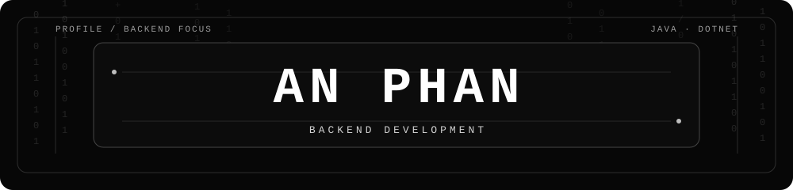

  

  

    <strong>Backend-focused developer · Java / Spring Boot · C# / .NET</strong> 
    Building practical backend features and supporting product workflows with clear, maintainable code.
  

  

    <a href="https://anphan-portfolio-kappa.vercel.app">Portfolio</a> ·
    <a href="mailto:quocanphan123@gmail.com">Email</a> ·
    <a href="https://www.linkedin.com/in/an-phan-quoc-4307782b5/">LinkedIn</a> ·
    <a href="https://github.com/Anphan0612?tab=repositories">GitHub repositories</a>
  

## About

I'm **Phan Quốc An**, an IT student at **Sai Gon University** in Ho Chi Minh City, Vietnam, expecting to graduate in 2027. I am seeking **Junior Backend Developer** roles and currently focus on Java / Spring Boot and C# / .NET.

My experience combines product development during my internship with collaborative backend projects. I care about readable code, dependable data workflows, and understanding how a feature behaves from API to user interface.

## Product internship

### HeraLabs · Software Engineer Intern

**June–August 2026**

I contributed to an existing asset- and inventory-management product across .NET APIs and Angular workflows.

#### C# / .NET

- Implemented inventory-import and import-history APIs with request validation, SQL Server staging through `SqlBulkCopy`, database transactions, and stored-procedure calls.
- Added import-file storage/download and history filtering; standardized API response messages for Angular localization.
- Centralized public URL generation for approval and recovery flows, and passed frontend URLs through notification handling.

#### Angular / TypeScript

- Built Excel import configuration, column mapping, preview, row validation, and error-file export using SheetJS; added the import-history UI.
- Implemented Vietnamese/English localization with Transloco, including runtime language switching and shared component translations.
- Integrated existing pagination and filtering into asset-management lists, and improved notification deep links and purchase-order terms dropdowns.

## Selected project contributions

### [FastFood Delivery Microservices](https://github.com/foodfast-delivery-microservice/FastfoodDelivery-microservice-monorepo)

**Team project · Java / Spring Boot / RabbitMQ**

**Live UI demo:** [Open FastFood demo](https://foodfast-delivery-microservice.github.io/FastfoodDelivery-microservice-monorepo/) · Sample data; API, login, and ordering are disabled.

**My contributions**

- Implemented email OTP verification with expiry and resend limits, plus password recovery with expiring reset tokens.
- Implemented RabbitMQ-driven email notification flows; added JUnit/Mockito notification tests and fixed mocking/assertion issues in order and payment tests.

### [Smart Personal Finance Management System](https://github.com/Anphan0612/Smart-Personal-Finance-Management-System)

**Collaborative project · Spring Boot / FastAPI / MySQL / React Native**

**Live UI demo:** [Open Smart Finance demo](https://anphan0612.github.io/Smart-Personal-Finance-Management-System/) · Sample data; API and write actions are disabled.

**My contributions**

- Updated backend dashboard logic to group weekly trends by weekday.
- Added CPU fallback and inference error handling in Vietnamese transaction extraction; improved CPU/CUDA model loading with CPU fallback for receipt OCR text correction.

## Tools used in these contributions

- **Backend:** Java, Spring Boot, C#, .NET, Entity Framework Core
- **Frontend:** Angular, TypeScript, Transloco, SheetJS
- **Data & testing:** SQL Server, MySQL, RabbitMQ, JUnit, Mockito

Thanks for visiting. Feel free to connect through [LinkedIn](https://www.linkedin.com/in/an-phan-quoc-4307782b5/) or explore my [repositories](https://github.com/Anphan0612?tab=repositories).
